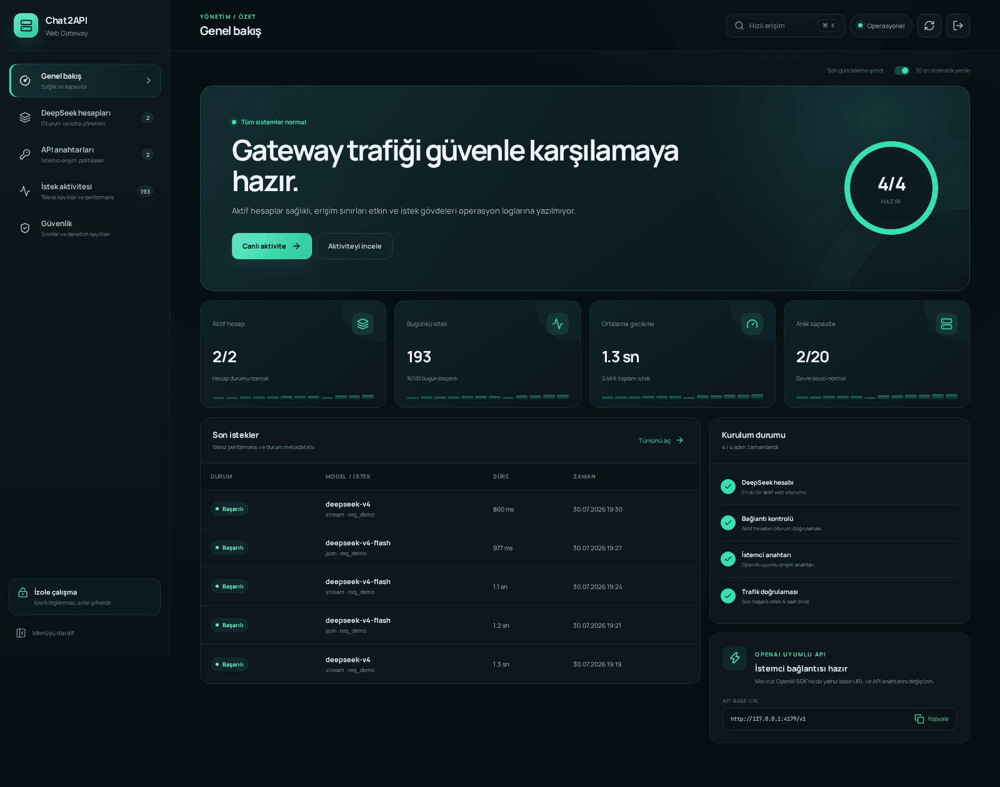
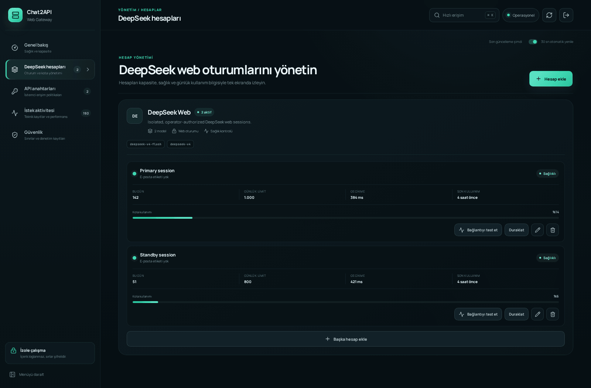
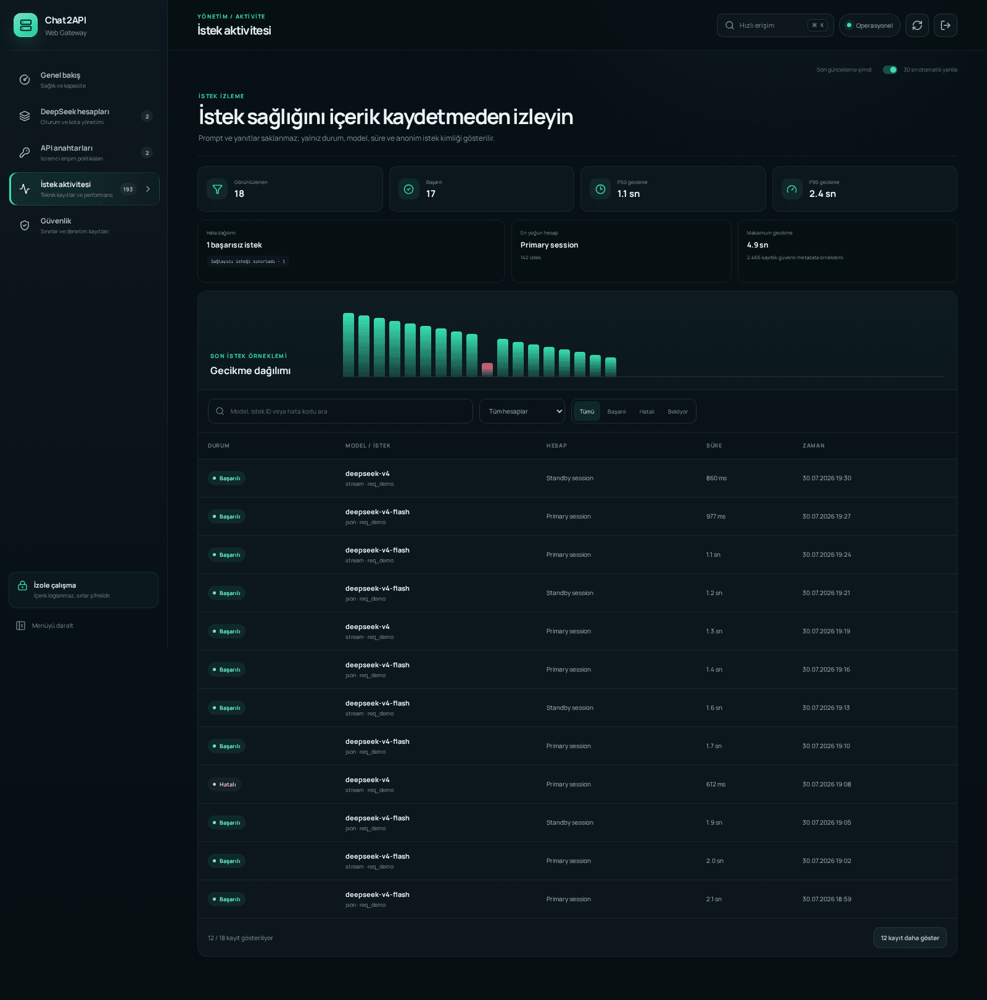
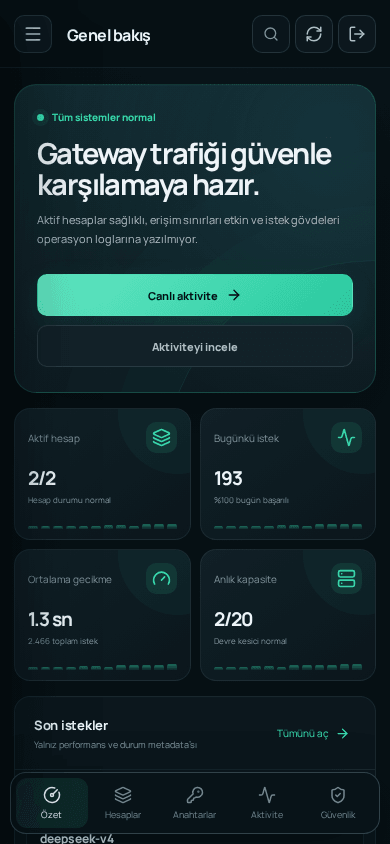
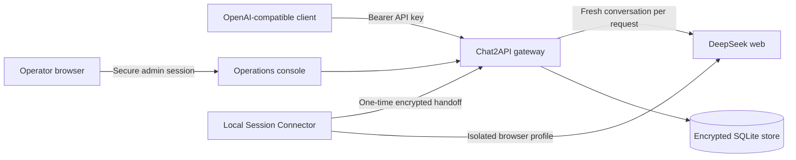

# Chat2API DeepSeek Web Gateway

[](https://github.com/ibrahimhalilkilicarslan/chat2api-web-gateway/actions/workflows/ci.yml)
[](https://github.com/ibrahimhalilkilicarslan/chat2api-web-gateway/releases)
[](LICENSE)
[](package.json)

A security-hardened, self-hosted OpenAI-compatible gateway for
operator-authorized DeepSeek web sessions. It combines a focused API surface
with encrypted credential storage, policy-controlled client keys, health-aware
routing, and a responsive operations console.

> [!IMPORTANT]
> This is an independent community project. It is not affiliated with, endorsed
> by, or supported by DeepSeek or OpenAI. DeepSeek's web protocol is
> undocumented and may change without notice. Review the provider's terms and
> use dedicated accounts you are authorized to operate.



_All screenshots use synthetic fixture data. No live endpoint, account,
credential, request, or customer information is included._

## Why this gateway

Chat2API intentionally keeps a narrow product boundary:

- OpenAI-compatible `GET /v1/models`
- OpenAI-compatible `POST /v1/chat/completions`
- JSON and SSE streaming responses
- Isolated DeepSeek web accounts with health-aware routing
- Hashed, scoped, expiring, CIDR-aware client API keys
- Metadata-only activity and security audit records
- A responsive Turkish, English, and Simplified Chinese admin console for
  accounts, quotas, keys, and operations
- A non-root, read-only, capability-free Docker runtime

Electron, bundled browsers, arbitrary providers, official API fallback, remote
media, tool emulation, persistent upstream conversations, and prompt or
completion logging are deliberately excluded.

## Product tour

<table>
  <tr>
    <td width="50%">
      
    </td>
    <td width="50%">
      
    </td>
  </tr>
  <tr>
    <td align="center"><strong>Account health and capacity</strong></td>
    <td align="center"><strong>Metadata-only operations visibility</strong></td>
  </tr>
</table>

<p align="center">
  
</p>

## Architecture



Each API request creates a fresh upstream conversation and removes it when the
response completes, fails, times out, or the client disconnects. Public response
IDs are generated locally and do not expose upstream conversation identifiers.

## Quick install

Requirements:

- Docker Engine
- Docker Compose v2
- OpenSSL
- A dedicated hostname with HTTPS for remote administration

```bash
git clone https://github.com/ibrahimhalilkilicarslan/chat2api-web-gateway.git
cd chat2api-web-gateway
./scripts/install.sh --origin https://gateway.example.com
```

The installer generates independent cryptographic secrets, writes a private
`.env` with mode `0600`, validates the Compose configuration, builds the
hardened image, and waits for readiness. It never prints the generated admin
token.

Retrieve the token locally when needed:

```bash
./scripts/show-admin-token.sh
```

For configuration-only setup:

```bash
./scripts/install.sh --origin https://gateway.example.com --no-start
```

See the complete [installation guide](docs/installation.md) before exposing an
instance to a network.

## Link a DeepSeek session

1. Open `https://gateway.example.com/admin/`.
2. Sign in with the locally retrieved admin token.
3. Download the
   [Chat2API Session Connector v0.2.0](https://github.com/ibrahimhalilkilicarslan/chat2api-session-connector/releases/tag/v0.2.0).
4. Start **Add account** and launch the connector from the admin console.
5. Sign in directly in the isolated provider window.
6. Wait for the gateway to validate and encrypt the transferred session.
7. Run the account health check before creating a client API key.

The interface follows the browser language on first use and keeps the operator's
Turkish, English, or Simplified Chinese selection locally in that browser.

The connector uses an installed Chromium-based browser with a temporary profile.
It does not read the default browser profile, capture passwords or OTP values,
persist provider tokens, install an extension, or run in the background. Manual
token entry remains an explicit recovery path.

## Use an OpenAI-compatible client

Create a client key in the admin console, then configure the existing OpenAI SDK
or any compatible client:

```bash
export OPENAI_BASE_URL="https://gateway.example.com/v1"
export OPENAI_API_KEY="<client-api-key>"
```

```bash
curl "${OPENAI_BASE_URL}/chat/completions" \
  -H "Authorization: Bearer ${OPENAI_API_KEY}" \
  -H "Content-Type: application/json" \
  -d '{
    "model": "deepseek-v4-flash",
    "messages": [
      {"role": "user", "content": "Reply with exactly OK."}
    ],
    "stream": false
  }'
```

Dependency-free [curl](examples/curl.sh), [Node.js](examples/node.mjs), and
[Python](examples/python.py) examples are included.

## Compatibility contract

| Route | Support |
| --- | --- |
| `GET /health` | Minimal service health |
| `GET /health/live` | Process liveness |
| `GET /health/ready` | Store readiness |
| `GET /v1/models` | Models available through active DeepSeek accounts |
| `POST /v1/chat/completions` | Text messages, JSON response, or SSE stream |
| `/admin/` | Accounts, keys, activity, audit, settings, and maintenance |

Accepted chat fields are `model`, `messages`, `stream`, `web_search`, and
`reasoning_effort`. Message roles are `system`, `user`, and `assistant`, with
string content only.

Images, files, tools, JSON mode, sampling controls, `/v1/completions`, and
`/v1/responses` fail explicitly instead of being silently ignored.

## Security model

- Bearer-only, fail-closed client authentication
- AES-256-GCM provider credential storage
- SHA-256 client-key storage; raw keys appear once
- Signed HttpOnly admin sessions with exact-origin CSRF protection
- Optional exact admin-host restriction
- No prompt, completion, cookie, provider payload, or credential persistence
- Fixed code-owned DeepSeek endpoints
- Strict text-only request schemas and bounded request bodies
- Global and per-account concurrency controls
- RPM, daily quota, model allowlist, expiry, and CIDR policies
- Circuit breakers with first-byte, request, and stream-idle timeouts
- Non-root container, read-only filesystem, dropped capabilities, and no Docker socket
- Full-history secret scanning and production dependency auditing in CI

`CHAT2API_MASTER_KEY` must remain stable while encrypted provider credentials
exist. Losing it makes those credentials unrecoverable. Back up the runtime
environment and SQLite volume separately, securely, and off-host.

Read [SECURITY.md](SECURITY.md) and [the security model](docs/security.md)
before production use. Report vulnerabilities privately through
[GitHub Security Advisories](https://github.com/ibrahimhalilkilicarslan/chat2api-web-gateway/security/advisories/new).

## Development

Requirements: Node.js `22.22.2+`, Corepack, and pnpm `11.18.0`.

```bash
corepack enable
corepack prepare pnpm@11.18.0 --activate
pnpm install --frozen-lockfile
pnpm setup -- --origin http://localhost:8080
pnpm doctor
docker compose -f compose.yaml -f compose.local.yaml up -d --build
```

Run the complete local gate:

```bash
pnpm check
docker compose -f compose.yaml -f compose.local.yaml config
docker build --tag chat2api-web-gateway:local .
pnpm smoke:container
```

A live provider smoke requires a dedicated test account and explicit operator
action:

```bash
CHAT2API_BASE_URL="https://gateway.example.com" \
CHAT2API_API_KEY="<client-api-key>" \
CHAT2API_SMOKE_MODEL="deepseek-v4-flash" \
CHAT2API_SMOKE_STREAM=true \
pnpm smoke:remote
```

## Documentation

- [Installation](docs/installation.md)
- [Client quickstart](docs/client-quickstart.md)
- [Architecture](docs/architecture.md)
- [Security](docs/security.md)
- [Deployment](docs/deployment.md)
- [Operations](docs/operations.md)
- [Admin access](docs/admin-access.md)
- [DeepSeek provider notes](docs/providers/deepseek.md)
- [Public release checklist](docs/public-release-checklist.md)

## Provenance and license

This repository is a substantial web-only, security-focused derivative of
[xiaoY233/Chat2API](https://github.com/xiaoY233/Chat2API). The upstream project,
its contributors, and its GPL notices are preserved in the Git history and
[third-party notices](THIRD_PARTY_NOTICES.md).

Chat2API DeepSeek Web Gateway is distributed under
[GPL-3.0](LICENSE). Contributions are welcome under the same license; see
[CONTRIBUTING.md](CONTRIBUTING.md).
